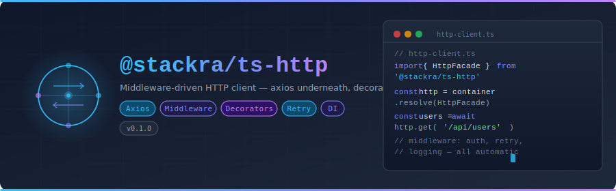

<p align="center">
  
</p>

<p align="center">
  <a href="https://www.npmjs.com/package/@stackra/ts-http">
    
  </a>
  <a href="./LICENSE">
    
  </a>
  <a href="https://www.typescriptlang.org/">
    
  </a>
</p>

---

# @stackra/ts-http

Middleware-driven HTTP client for TypeScript — axios underneath, decorator-based
middleware registration, and DI integration via `@stackra/ts-container`.

## Installation

```bash
pnpm add @stackra/ts-http
```

## Features

- 🔗 Axios-based HTTP client
- 🎭 `@Middleware()` decorator for declarative middleware registration
- 💉 DI integration — inject `HttpService` anywhere
- 🔄 Request/response interceptor pipeline
- 🏗️ `HttpModule.forRoot()` / `forFeature()` pattern
- 🔧 Per-service middleware overrides

## Quick Start

```typescript
import { Module } from '@stackra/ts-container';
import { HttpModule } from '@stackra/ts-http';

@Module({
  imports: [
    HttpModule.forRoot({
      baseURL: 'https://api.example.com',
      middleware: [AuthMiddleware, LoggingMiddleware],
    }),
  ],
})
export class AppModule {}
```

```typescript
import { Middleware, Injectable } from '@stackra/ts-container';
import { HttpService } from '@stackra/ts-http';

@Middleware(AuthMiddleware)
@Injectable()
class UserService {
  constructor(private http: HttpService) {}

  async getUsers() {
    return this.http.get('/users');
  }
}
```

## License

MIT © [Stackra](https://github.com/stackra-inc)
